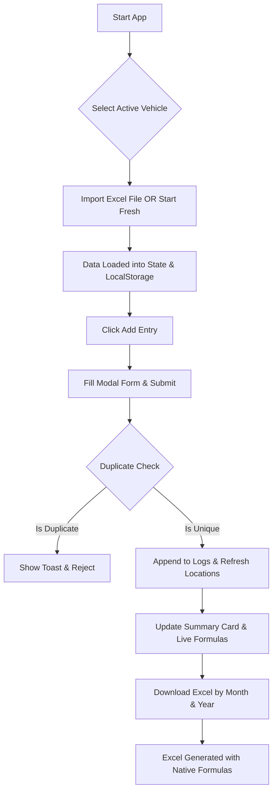

# LogiSheet (memo-app) — Project Specification

This document provides a comprehensive overview of **LogiSheet**, a mobile-first logistics tracking and spreadsheet management application. It outlines the project overview, technical stack, architecture, and detailed explanations of its key functionalities.

---

## 1. Application Overview

**LogiSheet** is a responsive, mobile-first web application designed to simplify log management for logistics operators, drivers, and fleet managers. The app acts as a digital logbook for tracking logistics shipments (loading locations, unloading locations, challans, weights, and rates) associated with specific vehicles.

### Core Goals
- **Client-Side Excel Processing:** Empower users to load existing `.xlsx` log files, append entries, perform margin calculations, and export updated spreadsheets directly from their device.
- **Offline-First & Local Persistence:** Store logistics data locally on the device (using standard Web Storage APIs) to prevent data loss in remote areas or poor connectivity zones.
- **Mobile-Optimized UX:** Deliver a premium, responsive interface featuring quick action menus, modals, and responsive layouts designed specifically for handheld displays.
- **Native Android Wrapper:** Packages the web application to run as a native Android app using Capacitor, allowing local file access and integration.

---

## 2. Technology Stack & Architecture

The application is structured as a modern Single Page Application (SPA) leveraging client-side libraries for file manipulation and user interface presentation.

### Technical Stack Table

| Component | Technology | Version | Description |
| :--- | :--- | :--- | :--- |
| **Core Library** | React | `^19.2.8` | Component-based UI library utilizing hooks and state. |
| **Build & Tooling** | Vite | `^8.1.5` | Fast build tool and module bundler with HMR support. |
| **UI Components** | Material-UI (MUI) | `^9.3.1` | Google Material Design component library. |
| **Icons** | MUI Icons | `^9.3.1` | Vector icons for UI actions. |
| **Styling Engine** | Emotion | `^11.14.0` | CSS-in-JS styled component framework used by MUI. |
| **Spreadsheet Engine** | SheetJS (xlsx) | `^0.18.5` | Excel parser/generator, installed via npm. |
| **Mobile Integration** | Capacitor | `^8.5.0` | Native runtime wrapping web apps for Android platforms. |
| **Fonts** | Google Fonts | CDN | `Outfit` (sans-serif) for clean, professional typography. |

### Folder Structure
The file structure is organized logically into components, custom hooks, utils, and assets:
- [src/App.jsx](file:///c:/Users/satish/Desktop/sagar-app/src/App.jsx): The application entry point, containing core state, event handlers, theme configuration, and dialog bindings.
- [src/components/](file:///c:/Users/satish/Desktop/sagar-app/src/components/): Contains presentation and interaction components:
  - [AddEntryDialog.jsx](file:///c:/Users/satish/Desktop/sagar-app/src/components/AddEntryDialog.jsx): Data entry modal form.
  - [SummaryDialog.jsx](file:///c:/Users/satish/Desktop/sagar-app/src/components/SummaryDialog.jsx): Aggregate calculation inspector.
  - [DownloadDialog.jsx](file:///c:/Users/satish/Desktop/sagar-app/src/components/DownloadDialog.jsx): Scoped monthly Excel exporter.
  - [Header.jsx](file:///c:/Users/satish/Desktop/sagar-app/src/components/Header.jsx): Vehicle select and dark/light toggle.
  - [ToolbarPanel.jsx](file:///c:/Users/satish/Desktop/sagar-app/src/components/ToolbarPanel.jsx): Desktop action bar with file dropzone.
  - [MobileBottomBar.jsx](file:///c:/Users/satish/Desktop/sagar-app/src/components/MobileBottomBar.jsx): Sticky mobile floating menu.
  - [LogsList.jsx](file:///c:/Users/satish/Desktop/sagar-app/src/components/LogsList.jsx) & [LogCard.jsx](file:///c:/Users/satish/Desktop/sagar-app/src/components/LogCard.jsx): Listing of records.
- [src/hooks/useLocalStorage.js](file:///c:/Users/satish/Desktop/sagar-app/src/hooks/useLocalStorage.js): Syncs React states automatically with LocalStorage.
- [src/utils/excel.js](file:///c:/Users/satish/Desktop/sagar-app/src/utils/excel.js): Script containing SheetJS routines for reading and writing data, setting cell styles, formatting, and generating Excel formulas.
- [src/utils/formatters.js](file:///c:/Users/satish/Desktop/sagar-app/src/utils/formatters.js): Contains currency formatting, date parsing, and Excel date translation routines.
- [src/constants.js](file:///c:/Users/satish/Desktop/sagar-app/src/constants.js): Global app configuration, defaults, limits, and predefined location lists.

---

## 3. Key Functionality Details

### A. Dynamic Excel Import & Parsing
Users can load an existing logistics Excel sheet (`.xlsx` or `.xls`) into the app.
1. **Loose Column Indexing:** The parser searches for column headers using partial string matches:
   - *Date* contains `"date"`
   - *Challan No* contains `"challan"`
   - *Gate No* contains `"gate"`
   - *Vehicle* contains `"vehicle"` or `"vehical"`
   - *Loading* contains `"loading"`
   - *Unloading* contains `"unloading"`
   - *Weight* contains `"weight"`, `"kilo"`, or `"kg"`
   - *Rate* contains `"rate"` (excluding `"total rate"`)
2. **Date Translation:** Normalizes Excel numeric dates (base date Dec 30, 1899), JS Date objects, and ISO date strings into standard `DD/MM/YYYY` strings.
3. **Location Harvesting:** Gathers any custom locations found in the imported sheet and appends them to the auto-complete dropdown lists.
4. **Duplicate Safeguard:** Automatically skips rows that have duplicate Challan numbers or matching details to prevent log corruption.

### B. Interactive Form Entry (Modal Dialog)
Clicking **Add Entry** launches a modal form instead of cluttering the screen space.
- **Automatic Date Default:** Form field pre-populates with today's date.
- **Length Constraint Protection:**
  - *Challan No* is limited to **20 characters**.
  - *Gate No* is limited to **8 characters**.
- **Free-solo Autocomplete Locations:** Dropdowns for Loading and Unloading positions are preloaded with over 60 industrial hubs. Users can also type in fresh locations.
- **Mutual Exclusion Check:** Validates that loading and unloading locations are not identical.
- **Vehicle Scoping:** The entry is automatically assigned to the active vehicle selected in the header.

### C. Live Calculations & Sheet Summary
A central card or dialog displays aggregates dynamically as values change:
1. **Total Weight:** Calculates the sum of all entries' weight column:
   $$\text{Total Weight} = \sum \text{Weights (kg)}$$
2. **Total Rate:** Calculates the sum of all individual rates (rates are summed up directly, not multiplied by weight):
   $$\text{Total Rate} = \sum \text{Rates}$$
3. **Global Margin %:** An editable field allowing users to input a profit/agency margin (e.g. `2.5%` or `0.0%`).
4. **Net Payment:** Automatically computed using:
   $$\text{Net Payment} = \text{Total Rate} \times \left(1 - \frac{\text{Margin \%}}{100}\right)$$

### D. Formula-Driven Excel Generation (Export)
When exporting, the app creates a beautifully structured `.xlsx` file tailored with Excel formulas and precise formatting:
- **Sheet Architecture:**
  - Headers are placed in row 1.
  - Data entries populate rows 2 through $N+1$.
  - Row $N+2$ is kept empty as a visual spacer.
  - Row $N+3$ writes the `Total` rate formula: `=SUM(G2:G[N+1])`.
  - Row $N+4$ stores the `Global Margin %` decimal (formatted as `0.0%` in Excel).
  - Row $N+5$ writes the `Net Payment` formula referencing the cells above: `=G[TotalRowIdx]*(1-G[MarginRowIdx])`.
  - Row $N+6$ writes the active vehicle plate number.
- **Cell Styling & Auto-Fitting:**
  - Standard decimal format (`#,##0.00`) is assigned to all numeric rate, total, and net payment cells.
  - Column widths are computed dynamically based on the longest value to prevent clipped text or `###` display errors.

### E. Monthly Scope Exporter
Instead of exporting all historical data, the **Download Dialog** allows users to filter by:
1. **Active Vehicle:** Download records specific to the chosen vehicle registration.
2. **Date Range:** Filters records matching a specific Month and Year.
3. **Dynamic File Naming:** Generates files automatically using the pattern: `[MonthName]_[Year2Digit]_[VehicleNo].xlsx` (e.g., `August_26_LL6850.xlsx`).

---

## 4. Application Flow

The diagram below outlines the standard user interaction loop inside the app:

